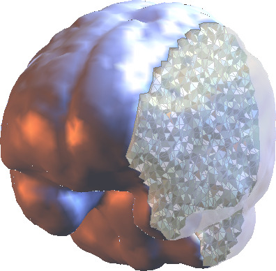
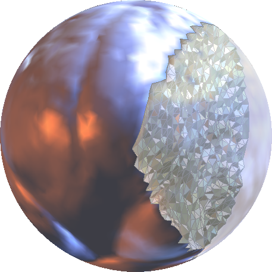

<h1 align="left"> Volume-Preserving Mesh Parameterization</h1>

   &nbsp; &nbsp; 
  

 

This repository provides an implementation of a convergent algorithm for ball-shaped volume-preserving parameterization of tetrahedral meshes.

If you use this code in your own work, please cite the following paper:

> [1] **S.-Y. Liu**, **T.-M. Huang**, **W.-W. Lin**, and **M.-H. Yueh**,  
> *Volume-Preserving Parameterizations via Preconditioned Nonlinear Conjugate Gradient Method*,  
> [doi: 10.1007/s10957-026-03002-5](https://doi.org/10.1007/s10957-026-03002-5).

---

### Main Function
`[S, VB, VI, Bdry] = BallIEM(T, V)`

Required Input:
* `T`: `#T x 3` triangulations of a trtrahedral mesh
* `V`: `#V x 3` vertex coordinates of a trtrahedral mesh

Output:
- `S`: `#V x 3` vertex coordinates of the balled volume-preserving map
- `VI`: indices of interior vertices
- `VB`: indices of boundary vertices
- `Bdry.F`: triangulations of a boundary triangular mesh
- `Bdry.V`: vertex coordinates of a boundary triangular mesh
- `Bdry.S`: vertex coordinates of a boundary spherical map

Optional Input:
- `BallIEM( __, "MaxIter", Value)`: the maximum iterative number (default: 100)
- `BallIEM( __, "Tol", Value)`: the tolerance of objective function deficit (default: 1e-6)

---

### License

This software is released for academic and research purposes only.  
Commercial use is not permitted without prior written permission from the authors.

© 2026 Shu-Yung Liu and Mei-Heng Yueh
